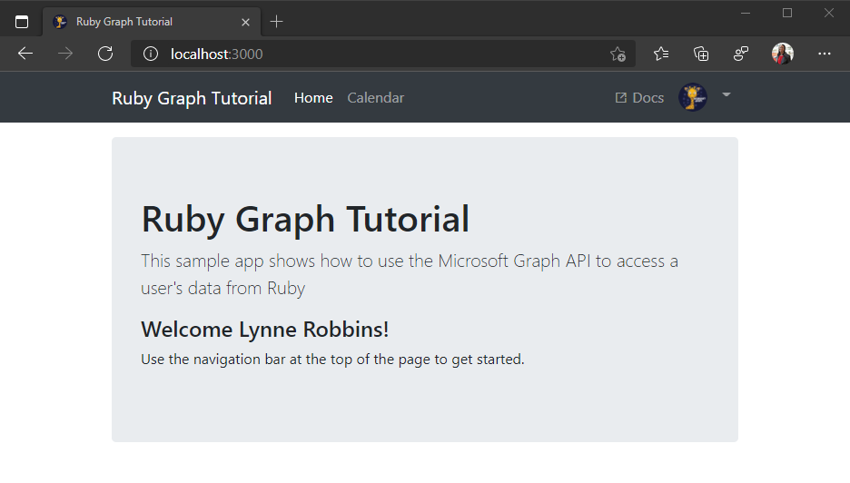

<!-- markdownlint-disable MD002 MD041 -->

この演習では、前の演習からアプリケーションを拡張して、Azure サーバーでの認証をサポートAD。 これは、Microsoft サーバーを呼び出す必要がある OAuth アクセス トークンを取得するために必要Graph。 この手順では [、omniauth-oauth2](https://github.com/omniauth/omniauth-oauth2) gem をアプリケーションに統合し、カスタムの OmniAuth 戦略を作成します。

1. アプリ ID とシークレットを保持する個別のファイルを作成します。 ./config フォルダーで呼 `oauth_environment_variables.rb` び出された新しい **ファイルを作成** し、次のコードを追加します。

    :::code language="ruby" source="../demo/graph-tutorial/config/oauth_environment_variables.rb.example":::

1. アプリケーション `YOUR_APP_ID_HERE` 登録ポータルのアプリケーション ID に置き換え、生成 `YOUR_APP_SECRET_HERE` したパスワードに置き換える。

    > [!IMPORTANT]
    > git などのソース管理を使用している場合は、アプリ ID とパスワードが誤って漏洩しないように、ソース管理からファイルを除外する良い時期 `oauth_environment_variables.rb` です。

1. **./config/environment.rb を** 開き、行の前に次のコードを追加 `Rails.application.initialize!` します。

    :::code language="ruby" source="../demo/graph-tutorial/config/environment.rb" id="LoadOAuthSettingsSnippet" highlight="4-6":::

## <a name="setup-omniauth"></a>セットアップの OmniAuth

Gem は既にインストール済みですが、Azure OAuth エンドポイントで動作するには `omniauth-oauth2` [、OAuth2](https://github.com/omniauth/omniauth-oauth2#creating-an-oauth2-strategy)戦略を作成する必要があります。 これは、Azure プロバイダーに OAuth 要求を行うパラメーターを定義する Ruby クラスです。

1. `microsoft_graph_auth.rb` **./lib '**** フォルダーで呼び出された新しいファイルを作成し、次のコードを追加します。

    :::code language="ruby" source="../demo/graph-tutorial/lib/microsoft_graph_auth.rb" id="AuthStrategySnippet":::

    このコードの動作を確認してください。

    - この設定では `client_options` 、エンドポイントのMicrosoft ID プラットフォーム設定します。
    - 承認フェーズ中に `scope` パラメーターを送信するように指定します。
    - ユーザーの `id` プロパティをユーザーの一意の ID としてマップします。
    - アクセス トークンを使用して、Microsoft からユーザーのプロファイルを取得し、Graph入力 `raw_info` します。
    - アプリ登録ポータルで登録されたコールバックと一致するコールバック URL を上書きします。

1. `omniauth_graph.rb` **./config/initializers** フォルダーで呼び出される新しいファイルを作成し、次のコードを追加します。

    :::code language="ruby" source="../demo/graph-tutorial/config/initializers/omniauth_graph.rb" id="ConfigureOmniAuthSnippet":::

    このコードは、アプリの起動時に実行されます。 このミドルウェアは、プロバイダーを使用して OmniAuth ミドルウェアを読み込み、oauth_environment_variables.rb に設定 `microsoft_graph_auth` **された環境変数で構成します**。

## <a name="implement-sign-in"></a>サインインの実装

これで、OmniAuth ミドルウェアが構成されたので、アプリへのサインインの追加に進む必要があります。

1. CLI で次のコマンドを実行して、サインインとサインアウトのコントローラーを生成します。

    ```Shell
    rails generate controller Auth
    ```

1. **./app/controllers/auth_controller.rb を開きます**。 クラスにコールバック メソッドを追加 `AuthController` します。 このメソッドは、OAuth フローが完了すると、OmniAuth ミドルウェアによって呼び出されます。

    ```ruby
    def callback
      # Access the authentication hash for omniauth
      data = request.env['omniauth.auth']

      # Temporary for testing!
      render json: data.to_json
    end
    ```

    今のところ、これは OmniAuth によって提供されるハッシュをレンダリングする作業です。 これを使用して、サインインが動作しているか確認してから、次に進む必要があります。

1. ルートを **./config/routes.rb に追加します**。

    ```ruby
    # Add route for OmniAuth callback
    match '/auth/:provider/callback', :to => 'auth#callback', :via => [:get, :post]
    ```

1. サーバーを起動し、を参照します `https://localhost:3000` 。 [サインイン] ボタンをクリックすると、`https://login.microsoftonline.com` にリダイレクトされます。 Microsoft アカウントでログインし、要求されたアクセス許可に同意します。 ブラウザーはアプリにリダイレクトされ、OmniAuth によって生成されたハッシュが表示されます。

    ```json
    {
      "provider": "microsoft_graph_auth",
      "uid": "eb52b3b2-c4ac-4b4f-bacd-d5f7ece55df0",
      "info": {
        "name": null
      },
      "credentials": {
        "token": "eyJ0eXAi...",
        "refresh_token": "OAQABAAA...",
        "expires_at": 1529517383,
        "expires": true
      },
      "extra": {
        "raw_info": {
          "@odata.context": "https://graph.microsoft.com/v1.0/$metadata#users(displayName,mail,mailboxSettings,userPrincipalName)/$entity",
          "displayName": "Lynne Robbins",
          "mail": "LynneR@contoso.OnMicrosoft.com",
          "userPrincipalName": "LynneR@contoso.OnMicrosoft.com",
          "id": "d294e784-840e-4f9f-bb1e-95c0a75f2f18@2d18179c-4386-4cbd-8891-7fd867c4f62e",
          "mailboxSettings": {
            "archiveFolder": "AAMkAGI2...",
            "timeZone": "Pacific Standard Time",
            "delegateMeetingMessageDeliveryOptions": "sendToDelegateOnly",
            "dateFormat": "M/d/yyyy",
            "timeFormat": "h:mm tt",
            "automaticRepliesSetting": {
              "status": "disabled",
              "externalAudience": "all",
              "internalReplyMessage": "",
              "externalReplyMessage": "",
              "scheduledStartDateTime": {
                "dateTime": "2020-12-09T17:00:00.0000000",
                "timeZone": "UTC"
              },
              "scheduledEndDateTime": {
                "dateTime": "2020-12-10T17:00:00.0000000",
                "timeZone": "UTC"
              }
            },
            "language": {
              "locale": "en-US",
              "displayName": "English (United States)"
            },
            "workingHours": {
              "daysOfWeek": [
                "monday",
                "tuesday",
                "wednesday",
                "thursday",
                "friday"
              ],
              "startTime": "08:00:00.0000000",
              "endTime": "17:00:00.0000000",
              "timeZone": {
                "name": "Pacific Standard Time"
              }
            }
          }
        }
      }
    }
    ```

## <a name="storing-the-tokens"></a>トークンの格納

トークンを取得できるようになったので、トークンをアプリに格納する手順を実装します。 これはサンプル アプリのため、わかりやすくするため、セッションに保存します。 実際のアプリでは、データベースのような、より信頼性の高い安全なストレージ ソリューションを使用します。

1. **./app/controllers/application_controller.rb を開きます**。 次のメソッドを `ApplicationController` クラスに追加します。

    :::code language="ruby" source="../demo/graph-tutorial/app/controllers/application_controller.rb" id="SaveInSessionSnippet":::

    このメソッドは、OmniAuth ハッシュをパラメーターとして受け取り、関連する情報を抽出し、その情報をセッションに格納します。

1. アクセサー関数をクラスに追加して、ユーザー名、電子メール アドレス、およびアクセス トークンをセッションから戻 `ApplicationController` します。

    ```ruby
    def user_name
      session[:user_name]
    end

    def user_email
      session[:user_email]
    end

    def user_timezone
      session[:user_timezone]
    end

    def access_token
      session[:graph_token_hash][:token]
    end
    ```

1. アクションが処理される前に実行 `ApplicationController` されるクラスに、次のコードを追加します。

    :::code language="ruby" source="../demo/graph-tutorial/app/controllers/application_controller.rb" id="BeforeActionSnippet":::

    このメソッドは、レイアウト **(l.erb** application.htm) がナビゲーション バーにユーザーの情報を表示するために使用する変数を設定します。 ここに追加することで、このコードをすべてのコントローラー アクションに追加する必要はありません。 ただし、これは、最適ではない、 のアクション `AuthController` にも対して実行されます。

1. 次のコードを `AuthController` **./app/controllers/auth_controller.rb** のクラスに追加して、before アクションをスキップします。

    ```ruby
    skip_before_action :set_user
    ```

1. クラスの `callback` 関数を更新 `AuthController` して、トークンをセッションに格納し、メイン ページにリダイレクトします。 既存の `callback` 関数を、以下の関数で置き換えます。

    :::code language="ruby" source="../demo/graph-tutorial/app/controllers/auth_controller.rb" id="CallbackSnippet":::

## <a name="implement-sign-out"></a>サインアウトの実装

この新機能をテストする前に、サインアウトする方法を追加します。

1. 次のアクションをクラスに追加 `AuthController` します。

    :::code language="ruby" source="../demo/graph-tutorial/app/controllers/auth_controller.rb" id="SignOutSnippet":::

1. このアクションを **./config/routes.rb に追加します**。

    ```ruby
    get 'auth/signout'
    ```

1. サーバーを再起動し、サインイン プロセスを実行します。 ホーム ページに戻る必要がありますが、サインイン済みかどうかを示す UI が変更される必要があります。

    

1. 右上隅にあるユーザー アバターをクリックして、[サインアウト] **リンクにアクセス** します。 **[サインアウト]** をクリックすると、セッションがリセットされ、ホーム ページに戻ります。

    ![[サインアウト] リンクのドロップダウン メニューのスクリーンショット](./images/add-aad-auth-02.png)

## <a name="refreshing-tokens"></a>トークンの更新

OmniAuth によって生成されたハッシュを注意して確認すると、ハッシュに 2 つのトークンが含まれます。 `token` `refresh_token` 値は `token` アクセス トークンで、API 呼び出しの `Authorization` ヘッダーで送信されます。 これは、アプリがユーザーの代わりに Microsoft Graphアクセスできるトークンです。

ただし、このトークンは一時的なものです。 トークンは発行後 1 時間で期限切れになります。 この値が役 `refresh_token` に立つ場所です。 更新トークンを使用すると、ユーザーが再度サインインしなくても、アプリは新しいアクセス トークンを要求できます。 トークンの更新を実装するためにトークン管理コードを更新します。

1. **./app/controllers/application_controller.rb** を開き、上部に次の `require` ステートメントを追加します。

    ```ruby
    require 'microsoft_graph_auth'
    require 'oauth2'
    ```

1. 次のメソッドを `ApplicationController` クラスに追加します。

    :::code language="ruby" source="../demo/graph-tutorial/app/controllers/application_controller.rb" id="RefreshTokensSnippet":::

    このメソッドは [、oauth2](https://github.com/oauth-xx/oauth2) gem (gem の依存関係) を使用してトークンを更新し、 `omniauth-oauth2` セッションを更新します。

1. 現在のメソッドを `access_token` 次に置き換える。

    :::code language="ruby" source="../demo/graph-tutorial/app/controllers/application_controller.rb" id="AccessTokenSnippet":::

    セッションからトークンを返すのではなく、トークンが有効期限に近い場合に最初に確認します。 その場合は、トークンを返す前に更新されます。
